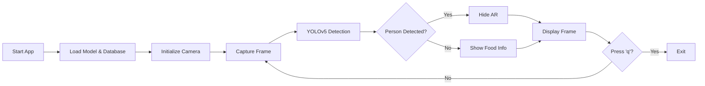

# Food Calories AR

A real-time Augmented Reality system that detects food items through your camera and displays nutritional information using computer vision and deep learning.

## Features

- **Real-time Food Detection**: Uses YOLOv5 model to identify food items from camera feed
- **Nutritional Information**: Displays calories and serving size for detected foods
- **Privacy Protection**: Automatically hides AR overlays when people are detected
- **Confidence Indicators**: Visual confidence gauges for detection accuracy
- **Mirror Mode**: Flipped camera view for better user experience
- **Real-time Performance**: Optimized for smooth FPS with live video processing

## Technologies Used

- **Computer Vision**: OpenCV for image processing and camera capture
- **Deep Learning**: YOLOv5 (PyTorch) for object detection
- **Augmented Reality**: 2D overlay system with semi-transparent UI elements
- **Database**: JSON-based food nutrition database
- **Privacy**: Automatic person detection and AR hiding

## System Flow



## Installation

### Prerequisites
- Python 3.8+
- Webcam or camera device
- Linux/macOS/Windows

### Setup

1. **Clone the repository**
   ```bash
   git clone <repository-url>
   cd food_calories_ar_ai
   ```

2. **Install dependencies**
   ```bash
   pip install -e .
   ```
   
   Or install dependencies manually:
   ```bash
   pip install opencv-python torch torchvision numpy Pillow PyYAML requests matplotlib seaborn pandas tqdm scipy thop
   ```

3. **Ensure your model file is present**
   - Place your trained YOLOv5 model as `best.pt` in the root directory
   - The model should be trained for food detection

4. **Optional: Customize food database**
   - Edit `food_database.json` to add/modify nutritional information
   - Format: `{"food_name": {"calories": "value", "serving_size": "description"}}`

## Usage

### Basic Usage

```bash
python food_calories_ar.py
```

### Controls
- **'q'**: Quit the application
- The camera feed will show:
  - Green bounding boxes around detected food
  - Information panels with calories and serving size
  - Confidence gauges for detection accuracy
  - FPS counter and system status
- When a person is detected in the frame, there will be no AR overlay.

## Project Structure

```
food_calories_ar_ai/
├── best.pt                 # Trained YOLOv5 model
├── food_calories_ar.py     # Main application
├── food_database.json      # Nutritional information database
├── detect.py              # YOLOv5 detection utilities
├── models/                # YOLOv5 model architectures
├── utils/                 # YOLOv5 utility functions
├── pyproject.toml         # Project dependencies
└── README.md              # This file
```

## Configuration

### Model Configuration
- Default model path: `best.pt`
- Confidence threshold: 0.25
- IoU threshold: 0.45
- Input size: 640x640

### Camera Settings
- Auto-calibration for AR positioning
- Mirror mode enabled by default
- Automatic resolution detection

### Display Settings
- Info panel size: 200x80 pixels
- Semi-transparent overlays (70% opacity)
- Color-coded confidence gauges

## Food Database

The system uses a JSON database (`food_database.json`) for nutritional information:

```json
{
  "apple": {
    "calories": "52 per 100g",
    "serving_size": "1 medium apple"
  },
  "banana": {
    "calories": "89 per 100g", 
    "serving_size": "1 medium banana"
  }
}
```

To add new foods:
1. Open `food_database.json`
2. Add entries following the format above
3. Restart the application